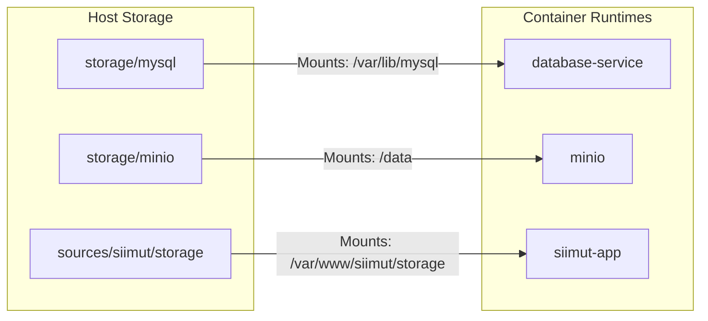

# Detailed Project Structure & Architecture Guide — RSCH Application Platform

This document provides a deep-dive architectural map of the **RSCH Application Platform**. It details every file, directory, named volume, network interface, port allocation, and structural design decision.

---

## 📂 Directory Layout (Root Overview)

Below is the complete tree representing the workspace organization.

```
rsch-apps/
├── compose/                         # Docker Compose modular configuration files
├── apps/                            # Application metadata and runtime base environments
├── docker/                          # Low-level service and container runtimes configs
├── env/                             # Environment variables & runtime secrets (Gitignored)
├── scripts/                         # Command utilities, health checkers, & maintenance scripts
├── sources/                         # Raw application source code directories (Gitignored)
├── storage/                         # Local mount directories for persistent database/storage files
├── ansible/                         # Remote setup and deployment playbooks
│
├── compose.yml                      # Main Compose aggregator manifest
├── rsch                             # Platform Orchestration CLI entrypoint
├── repos.csv                        # Global repository configuration registry
├── .env.example                     # Reference template for top-level platform env variables
├── .app-modes                       # Internal registry for chosen app prepare modes (Gitignored)
│
├── README.md                        # Quick-start and main systems overview
└── docs/                            # Deep-dive platform documentation
    ├── USAGE.md                     # Exhaustive runtime and operations guide
    └── STRUCTURE.md                 # This file
```

---

## 🐳 Modular Compose Architecture (`compose/`)

The platform avoids a single massive `docker-compose.yml` file by using the `include` and `extends` directives of Docker Compose v2. The files are divided as follows:

```
compose/
├── base/                            # Core infrastructural engines
│   ├── infra.yml                    # Aggregator manifest to run all core infrastructure
│   ├── network.yml                  # Configures global network (172.20.0.0/16) and volumes
│   ├── web.yml                      # Main Nginx router with multi-vhost mapping & port binds
│   ├── database.yml                 # MySQL 8.0 instance (database-service)
│   ├── minio.yml                    # MinIO S3 object storage server & auto-bucket creation job
│   ├── phpmyadmin.yml               # Web interface for database administration (Development only)
│   └── php-base.yml                 # Core PHP-FPM service templates (App, Queue Worker, Scheduler)
│
├── apps/                            # Application-specific Compose definitions (Modular)
│   ├── siimut.yml                   # SIIMUT containers (App, Queue Daemon, Cron Scheduler)
│   ├── ikp.yml                      # IKP containers (App, Queue Daemon, Cron Scheduler)
│   ├── iam.yml                      # SSO Server containers (App, Queue Daemon, Cron Scheduler)
│   └── lms.yml                      # Learning Management System container (App only)
│
├── profiles/                        # Environment port maps & runtime mode overrides
│   ├── dev.yml                      # Maps applications to development ports (8xx10 series)
│   └── prod.yml                     # Maps applications to standard production ports (8xx00 series)
│
└── build.yml                        # Manifest detailing instructions to build images locally
```

### 🧬 Inheritance Diagram
```
              [ compose.yml ] (Root Entrypoint)
                     │
         ┌───────────┴───────────┐
         ▼                       ▼
 [ compose/profiles/dev.yml ]  [ compose/apps/*.yml ]
       - or -                    │ (Inherits base traits)
 [ compose/profiles/prod.yml ]   ▼
                       [ compose/base/php-base.yml ]
                         ├── php-app-base
                         ├── php-worker-base
                         └── php-scheduler-base
```

---

## 📋 Application Registry & Configurations

### `apps/` Directory
Contains configurations used for building and bootstrapping each individual application.
*   `apps/<app>/app.yml`: Metadata registry listing repository endpoint, active branch, target directory name, database name, and status of queue/scheduler.
*   `apps/<app>/Dockerfile`: Custom multi-stage build instructions optimized for production.
*   `apps/<app>/.env.example`: Template variables representing production-specific values (e.g. database credentials, API endpoints).

### `repos.csv`
A central tabular registry read by scripts to discover applications. Format:
```csv
name,dir,repo,branch,has_prod,has_deps,desc
siimut,siimut,https://github.com/juniyasyos/si-imut.git,main,yes,yes,Sistem Informasi Imunisasi
iam,iam,https://github.com/juniyasyos/iam-server.git,main,yes,yes,Authentication & SSO Server
ikp,ikp,https://github.com/juniyasyos/ikp.git,main,yes,yes,Incident Reporting & Pelaporan
lms,lms,https://github.com/juniyasyos/lms-citrahusada.git,main,yes,yes,Learning Management System
```

### `.app-modes` (New)
Maintains states between interactive preparation runs. It holds the active configuration source for each app (e.g. Dockerfile generation, local Git code building, or direct Docker registry consumption):
```ini
siimut=clone:https://github.com/juniyasyos/si-imut.git
iam=image:ghcr.io/juniyasyos/iam-server:v2.1.0
ikp=dockerfile:laravel
```

---

## ⚙️ Container Engine Configurations (`docker/`)

Low-level configuration templates used to customize the behavior of runtime environments.

*   **`docker/nginx/`**:
    *   `nginx.conf`: Global Nginx configurations (performance, compression, log format).
    *   `nginx-multi-apps.conf`: Virtual hosts setup. Routes subdomains/ports to internal fastcgi application ports.
*   **`docker/php/`**:
    *   `Dockerfile.production`: Master PHP 8.x Alpine template.
        > [!NOTE]
        > This file serves as a reference template for manual container configuration. Production builds use specific Dockerfiles located under `apps/<app>/Dockerfile` for modular isolation.
    *   `entrypoint.sh`: Bootstrapping runtime scripts. Runs DB migrations, configures cached caches (config/routes/events), verifies database socket readiness, and launches php-fpm or supervisor process managers.
    *   `entrypoint-iam.sh`: Custom entrypoint for IAM Server (generating and validating Passport RSA keys).
    *   `php.ini`: Hardened production settings (OPcache JIT enabled, memory limit tuning, safety options).
    *   `supervisord.conf`: Process manager configuration. Runs queue workers and schedule runners concurrently in the same runtime namespace if required.
*   **`docker/db/`**:
    *   `my.cnf`: Hardened MySQL configuration (memory limits, storage engines tuning).
    *   `sql/`: Database initialization scripts. Any `.sql` or `.sh` script placed here will execute automatically when the database service boots up for the first time.

---

## 🐍 Orchestration & Maintenance Automation (`scripts/`)

```
scripts/
├── prepare.sh                       # Core unified orchestration logic (runs mode selection)
├── build.sh                         # Automated image compiling and tagging
├── deploy.sh                        # Interface between ./rsch commands and docker compose execution
│
├── prepare/                         # Modularity adapters for rsch prepare modes
│   ├── mode_dockerfile.sh           #   [Mode 1] Generates custom PHP-Alpine Dockerfiles
│   ├── mode_clone.sh                #   [Mode 2] Orchestrates Git pulling, NPM building, and secret generation
│   ├── mode_image.sh                #   [Mode 3] Binds external container images to deployment registry
│   └── install-docker.sh            #   Installs Docker Engine on clean Debian/Ubuntu hosts
│
├── health/                          # Environment health check procedures
│   ├── check-iam.sh                 #   Validates SSO server API responsiveness & JWT token states
│   └── check-minio.sh               #   Validates MinIO API port connectivity
│
└── maintenance/                     # Troubleshooting utilities
    ├── diagnose.sh                  #   General stack connectivity diagnostics helper
    ├── diagnose-autoload.sh         #   Verifies composer autoload integrity inside sources/
    ├── diagnose-iam.sh              #   SSO specific database & route connectivity test
    ├── diagnose-livewire.sh         #   Verifies Livewire CDN asset publication statuses
    ├── diagnose-signatory.sh        #   Checks cryptographic key validity
    └── fix-network.sh               #   Flushes and restarts container networks to solve route conflicts
```

> [!WARNING]
> **Renamed Diagnostic scripts**: The script `scripts/health/check-jwt.sh` has been renamed to [scripts/health/check-iam.sh](file:///home/juni/projects/docker/rsch-apps/scripts/health/check-iam.sh) to match the naming of the target application "IAM" and facilitate execution through the unified `./rsch health iam` endpoint.

---

## 🔒 Storage, Sources, & Variables Segregation

### `sources/` (Gitignored)
Raw code repositories cloned from origin Git URLs. These folders are mounted to containers as volumes when running in development/debug mode to enable instant code reloading.
*   `sources/siimut/`
*   `sources/ikp/`
*   `sources/iam/`
*   `sources/lms/`

### `storage/` (Gitignored)
Persistent volumes mounted on the host machine to prevent data loss when containers are destroyed or updated.
*   `storage/mysql/`: Relational database files.
*   `storage/minio/`: Object storage bucket directories.
*   `storage/logs/`: Unified location for runtime PHP logs.

### `env/` (Gitignored)
*   `common.env`: Shared parameters (root credentials).
*   `dev.env`: Development variables (bind IP, development ports map).
*   `prod.env`: Production variables (bind IP, production ports map).
*   `.env.prod.<app>` (Generated): Dynamically generated secrets for production mode.

---

## 🌐 Network Topography & Volume Map

### Logical Network Settings
*   **Network Name**: `rsch-apps_default`
*   **Subnet CIDR**: `172.20.0.0/16`
*   **Gateway**: `172.20.0.1`

| Service | Container Alias | Internal Port | Exposed Port (Dev) | Exposed Port (Prod) |
| :--- | :--- | :---: | :---: | :---: |
| Nginx Reverse Proxy | `multi-web` | `80`, `443` | `80`, `443` | `80`, `443` |
| MySQL Database | `database-service` | `3306` | `3306` | — |
| MinIO Storage API | `minio` | `9000` | `9090` | `9090` |
| MinIO Web Console | `minio` | `9001` | `9091` | `9091` |
| phpMyAdmin | `phpmyadmin` | `80` | `8888` | — |
| SIIMUT Application | `siimut-app` | `9000` | `8010` | `8000` |
| IAM Server SSO | `iam-app` | `9000` | `8110` | `8100` |
| IKP Incident Service | `ikp-app` | `9000` | `8210` | `8200` |
| LMS CitraHusada | `lms-app` | `9000` | `7000` | `7000` |

### Core Volume Maps

