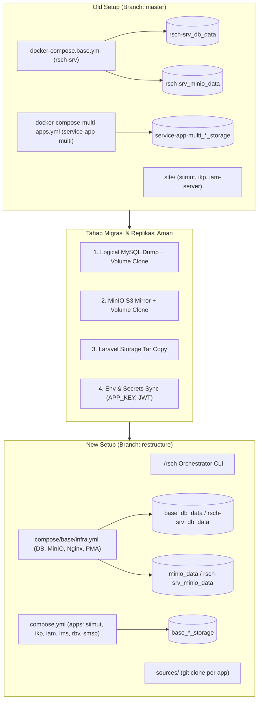

# Rencana Migrasi: master (Arsitektur Lama) ➔ restructure (Arsitektur Baru)

## Goal Description
Melakukan migrasi infrastruktur dan aplikasi **RSCH Application Platform** pada server produksi dari arsitektur lama (branch `master`) ke arsitektur modular ter-restruktur (branch `restructure`).

Tujuan utama rencana ini adalah:
1. **Zero Data Loss**: Menjamin seluruh data database MySQL (`siimut_db`, `ikp_db`, `iam_db`, dll.), file MinIO S3 (seluruh bucket objek/lampiran), persistent storage Laravel (dokumen upload, berkas medis/laporan, tanda tangan, sertifikat), dan konfigurasi rahasia (`APP_KEY`, JWT secret, key OAuth) terlindungi 100% tanpa risiko terhapus atau tertimpa.
2. **Zero Oversight / Zero Regresi**: Memastikan seluruh konfigurasi port, subnet network, SSL/reverse proxy Nginx, daemon queue worker, scheduler, dan variabel environment terpetakan secara presisi tanpa ada yang terlewat.
3. **Minimal Downtime & Reversible**: Menjalankan pra-migrasi (persiapan image & salinan data) secara paralel saat sistem lama masih aktif, meminimalkan jendela maintenance (*cutover window*), serta menyediakan *Rollback Plan* yang dapat dieksekusi dalam hitungan menit jika terjadi kendala.

---

## User Review Required

> [!CAUTION]
> **PERBEDAAN NAMA VOLUME DOCKER DAPAT MENYEBABKAN VOLUME KOSONG JIKA TIDAK DIMIGRASI:**
> - Di branch `master`, Docker Compose menggunakan project name `rsch-srv` untuk base dan `service-app-multi` untuk apps. Nama volume yang terbentuk adalah:
>   - `rsch-srv_db_data` (Data MySQL)
>   - `rsch-srv_minio_data` (Data MinIO)
>   - `service-app-multi_siimut_storage`, `service-app-multi_ikp_storage`, `service-app-multi_iam_storage` (Laravel storage)
> - Di branch `restructure`, project name default adalah `base`. Jika container baru dijalankan tanpa pemetaan/salinan volume, Docker akan membuat volume baru yang **KOSONG** (`base_db_data`, `base_minio_data`, dll.) sehingga aplikasi akan terlihat kehilangan data!
> - **Solusi kami**: Menggunakan metode *Volume Cloning & Dual Backup* (Physical Volume Clone + Logical SQL Dump + MinIO Mirror), sehingga volume lama tetap utuh sebagai backup murni dan volume baru terisi data identik sebelum switchover.

> [!IMPORTANT]
> **JANGAN PERNAH MENJALANKAN `docker compose down -v` PADA SERVER LAMA:**
> Flag `-v` atau `--volumes` akan menghapus seluruh Docker Named Volumes secara permanen dari disk host! Perintah stop stack lama hanya boleh menggunakan `docker compose down` (tanpa `-v`).

> [!WARNING]
> **APP_KEY DAN ENCRYPTION SECRETS HARUS TETAP SAMA:**
> Jangan sekali-kali menjalankan `php artisan key:generate` pada aplikasi yang sudah berjalan. `APP_KEY` dan `IAM_JWT_SECRET` yang ada di server lama harus disalin persis ke file konfigurasi baru (`apps/<app>/.env` atau `env/prod.env`). Jika `APP_KEY` berubah, seluruh data database yang terenkripsi dan sesi pengguna akan corrupt.

---

## Open Questions

> [!NOTE]
> 1. **Apakah seluruh aplikasi saat ini (`siimut`, `ikp`, `iam`) aktif digunakan di server lama, atau ada aplikasi tambahan seperti `lms`, `rbv`, `smsp` yang sudah berjalan juga di server lama?**
> 2. **Apakah host server menggunakan domain name (misal: `siimut.rsch.co.id`) dengan reverse proxy publik (seperti Traefik/Cloudflare/Nginx Host), atau langsung diakses via IP & Port (misal: `192.168.1.4:8000`)?**
> 3. **Berapa estimasi ukuran data saat ini?** (Contoh: MySQL DB ~5GB, MinIO ~50GB). Hal ini menentukan estimasi waktu proses backup dan cutover window.

---

## Arsitektur Komparasi: Old vs New



---

## Tahapan Rencana Migrasi (Step-by-Step)

Rencana migrasi dibagi menjadi 5 fase yang terstruktur:
- **Fase 0**: Persiapan Direktori & Audit Server Lama
- **Fase 1**: Full Backup Komprehensif (3-Layer Safety Net)
- **Fase 2**: Persiapan Lingkungan Baru (Branch `restructure`) secara Paralel (Zero Downtime)
- **Fase 3**: Migrasi Data & Volume Cloning (Jendela Maintenance Singkat)
- **Fase 4**: Switchover & Launching Sistem Baru
- **Fase 5**: Verifikasi Menyeluruh & Post-Migration Health Check

---

### FASE 0: Persiapan Direktori & Audit Server Lama
*Tujuan: Mencatat baseline state sistem sebelum dilakukan perubahan apapun.*

1. **Buat Direktori Backup Terpusat di Luar Repository**:
   ```bash
   MIGRATION_DATE=$(date +%Y%m%d_%H%M%S)
   BACKUP_DIR="/home/it_support/migration_backup_${MIGRATION_DATE}"
   mkdir -p "${BACKUP_DIR}"/{mysql,minio,storages,envs,git_diffs}
   echo "Backup folder dibuat di: ${BACKUP_DIR}"
   ```

2. **Audit Kontainer, Volume, dan Network yang Sedang Aktif**:
   ```bash
   docker ps > "${BACKUP_DIR}/audit_docker_ps.txt"
   docker volume ls > "${BACKUP_DIR}/audit_docker_volumes.txt"
   docker network ls > "${BACKUP_DIR}/audit_docker_networks.txt"
   ```

3. **Audit Modifikasi Lokal pada Source Code Lama (`site/`)**:
   Periksa apakah ada perubahan koding yang belum di-commit ke Git di dalam folder `site/`:
   ```bash
   cd /home/it_support/projects/rsch/infra
   for dir in site/*/; do
     if [ -d "$dir/.git" ]; then
       app_name=$(basename "$dir")
       echo "Checking local diffs for $app_name..."
       git -C "$dir" status > "${BACKUP_DIR}/git_diffs/${app_name}_status.txt"
       git -C "$dir" diff > "${BACKUP_DIR}/git_diffs/${app_name}_diff.patch"
     fi
   done
   ```

---

### FASE 1: Full Backup Komprehensif (3-Layer Safety Net)
*Prinsip: Data tidak boleh dimanipulasi sebelum memiliki 3 lapis salinan cadangan.*

#### 1. Backup Database MySQL (Logical Dump & Row Count)
1. **Catat Jumlah Baris & Tabel**:
   ```bash
   docker exec -i database-service mysql -uroot -prootpass123 -e "
     SELECT table_schema, count(*) AS table_count 
     FROM information_schema.tables 
     WHERE table_schema NOT IN ('information_schema', 'mysql', 'performance_schema', 'sys') 
     GROUP BY table_schema;
   " > "${BACKUP_DIR}/mysql/baseline_table_counts.txt"
   ```

2. **Eksekusi Full MySQL Dump (Semua Database)**:
   ```bash
   docker exec -i database-service mysqldump -uroot -prootpass123 \
     --all-databases \
     --single-transaction \
     --quick \
     --routines \
     --triggers \
     --events > "${BACKUP_DIR}/mysql/all_databases_backup.sql"
   ```

3. **Eksekusi Dump Terpisah per Aplikasi**:
   ```bash
   for db in siimut_db ikp_db iam_db lms_db rbv_db smsp_db; do
     echo "Dumping database: $db..."
     docker exec -i database-service mysqldump -uroot -prootpass123 \
       --single-transaction --quick --routines --triggers "$db" > "${BACKUP_DIR}/mysql/${db}_backup.sql" 2>/dev/null || true
   done
   ```

#### 2. Backup MinIO Object Storage (S3)
1. **Snapshot Fisik Volume MinIO**:
   ```bash
   docker run --rm \
     -v rsch-srv_minio_data:/data:ro \
     -v "${BACKUP_DIR}/minio":/backup \
     alpine tar -czf /backup/minio_raw_data.tar.gz -C /data .
   ```

#### 3. Backup Laravel Persistent Storage Volumes
1. **Backup Volume Storage Masing-masing Aplikasi**:
   ```bash
   for vol in $(docker volume ls -q | grep -E 'service-app-multi.*storage|siimut_storage|ikp_storage|iam_storage'); do
     echo "Backing up volume $vol..."
     docker run --rm \
       -v "${vol}":/source:ro \
       -v "${BACKUP_DIR}/storages":/backup \
       alpine tar -czf "/backup/${vol}.tar.gz" -C /source .
   done
   ```

#### 4. Backup Seluruh Konfigurasi `.env` Lama
```bash
cp -a /home/it_support/projects/rsch/infra/.env* "${BACKUP_DIR}/envs/" 2>/dev/null || true
cp -a /home/it_support/projects/rsch/infra/env/ "${BACKUP_DIR}/envs/env_folder/" 2>/dev/null || true
find /home/it_support/projects/rsch/infra/site/ -name ".env" -exec cp --parents {} "${BACKUP_DIR}/envs/" \; 2>/dev/null || true
```

---

### FASE 2: Persiapan Lingkungan Baru (Branch `restructure`)
*Fase ini dapat dilakukan tanpa menghentikan server lama (zero downtime preparation).*

1. **Pastikan Kode Baru Tersedia**:
   Di mesin yang sama (atau direktori kerja paralel), git branch `restructure` sudah di-pull dan siap.
   ```bash
   git fetch origin
   git checkout restructure
   git pull origin restructure
   ```

2. **Sinkronisasi Konfigurasi Environment Produksi**:
   - Salin kredensial rahasia dari backup ke file konfigurasi baru:
     - `env/prod.env`: Pastikan `HOST_IP` sesuai IP server lama.
     - `env/common.env`: Pastikan `MYSQL_ROOT_PASSWORD` sesuai dengan server lama (`rootpass123` atau custom).
     - `apps/siimut/.env`: Pastikan `APP_KEY`, `DB_PASSWORD`, dan `IAM_JWT_SECRET` identik dengan `.env` lama.
     - `apps/ikp/.env`: Pastikan `APP_KEY` dan konfigurasi identik.
     - `apps/iam/.env`: Pastikan `APP_KEY`, `IAM_JWT_SECRET`, serta Passport Keys disalin ke `sources/iam-server/storage/` atau volume baru.

3. **Pre-build & Pre-pull Docker Images**:
   Build seluruh image baru terlebih dahulu agar saat downtime tidak memakan waktu unduh/kompilasi:
   ```bash
   # Menggunakan CLI platform baru
   ./rsch build siimut
   ./rsch build ikp
   ./rsch build iam
   # (atau aplikasi lain yang diaktifkan)
   ```

---

### FASE 3: Migrasi Data & Volume Cloning (Maintenance Window)
*Jendela maintenance dimulai di sini. Estimasi waktu: 10 - 20 menit.*

1. **Gracefully Stop Stack Lama (TANPA MENGHAPUS VOLUME)**:
   ```bash
   # Hentikan aplikasi terlebih dahulu agar tidak ada transaksi baru
   docker compose -f docker-compose-multi-apps.yml down
   
   # Hentikan database dan minio setelah semua koneksi tertutup
   docker compose -f docker-compose.base.yml down
   ```
   > [!IMPORTANT]
   > Jangan jalankan `docker volume prune` atau `down -v`! Seluruh volume lama `rsch-srv_*` dan `service-app-multi_*` tetap ada di sistem.

2. **Final Incremental Database Dump (Opsional jika ada jeda transaksi)**:
   Jika diperlukan, jalankan database sementara untuk memastikan buffer InnoDB ter-flush bersih:
   ```bash
   docker run --rm -v rsch-srv_db_data:/var/lib/mysql mysql:8.0 mysqld --skip-networking --innodb-fast-shutdown=0 &
   sleep 10
   docker stop $(docker ps -lq) 2>/dev/null || true
   ```

3. **Strategi Volume Database & MinIO (Pilihan Presisi)**:
   Terdapat 2 opsi untuk menghubungkan data ke arsitektur baru:
   
   * **Opsi A (Direkomendasikan - Volume Cloning / Zero Risk)**:
     Membuat volume baru `base_db_data` dan menyalin datanya dari `rsch-srv_db_data`. Volume lama tetap utuh sebagai arsip.
     ```bash
     # Buat volume database baru
     docker volume create base_db_data
     docker run --rm \
       -v rsch-srv_db_data:/from:ro \
       -v base_db_data:/to \
       alpine sh -c "cp -av /from/. /to/"

     # Buat volume minio baru
     docker volume create minio_data
     docker run --rm \
       -v rsch-srv_minio_data:/from:ro \
       -v minio_data:/to \
       alpine sh -c "cp -av /from/. /to/"
     ```

   * **Opsi B (Direct Volume Mapping)**:
     Memetakan langsung volume lama pada `compose/base/database.yml` dan `compose/base/minio.yml` menggunakan `external: true` atau variable `MINIO_VOLUME_NAME=rsch-srv_minio_data`.

4. **Salin Data Laravel Persistent Storage**:
   Salin berkas upload dari volume lama ke volume baru:
   ```bash
   # Salin SIIMUT Storage
   docker volume create base_siimut_storage
   docker run --rm \
     -v service-app-multi_siimut_storage:/from:ro \
     -v base_siimut_storage:/to \
     alpine sh -c "cp -av /from/. /to/ && chown -R 33:33 /to"

   # Salin IKP Storage
   docker volume create base_ikp_storage
   docker run --rm \
     -v service-app-multi_ikp_storage:/from:ro \
     -v base_ikp_storage:/to \
     alpine sh -c "cp -av /from/. /to/ && chown -R 33:33 /to"

   # Salin IAM Storage & Passport Keys
   docker volume create base_iam_storage
   docker run --rm \
     -v service-app-multi_iam_storage:/from:ro \
     -v base_iam_storage:/to \
     alpine sh -c "cp -av /from/. /to/ && chown -R 33:33 /to"
   ```

---

### FASE 4: Switchover & Menjalankan Arsitektur Baru
*Menjalankan infrastruktur dasar lalu aplikasi menggunakan `./rsch` CLI.*

1. **Jalankan Infrastruktur Dasar**:
   ```bash
   ./rsch infra up
   ```
   *Verifikasi*:
   - Cek kontainer: `docker ps` (pastikan `database-service`, `minio`, `minio-init`, `phpmyadmin`, `multi-web` running & healthy).
   - Tes koneksi database: `./rsch db shell` (cek tabel `SHOW DATABASES;`).

2. **Jalankan Aplikasi**:
   ```bash
   # Set environment mode ke prod
   ./rsch use prod

   # Jalankan aplikasi yang dimigrasikan
   ./rsch run-app siimut ikp iam
   # Atau jika seluruh aplikasi dijalankan:
   ./rsch up --prod
   ```

3. **Bersihkan Cache Internal Laravel (Crucial Step)**:
   ```bash
   ./rsch exec siimut php artisan config:clear
   ./rsch exec siimut php artisan cache:clear
   ./rsch exec siimut php artisan route:clear
   ./rsch exec siimut php artisan view:clear
   
   ./rsch exec ikp php artisan config:clear
   ./rsch exec ikp php artisan cache:clear
   
   ./rsch exec iam php artisan config:clear
   ./rsch exec iam php artisan cache:clear
   ```

---

### FASE 5: Verifikasi Menyeluruh & Post-Migration Health Check

#### 1. Verifikasi Integritas Data Database
Bandingkan jumlah tabel dan baris sebelum dan sesudah migrasi:
```bash
docker exec -i database-service mysql -uroot -prootpass123 -e "
  SELECT table_schema, count(*) AS table_count 
  FROM information_schema.tables 
  WHERE table_schema NOT IN ('information_schema', 'mysql', 'performance_schema', 'sys') 
  GROUP BY table_schema;
" > "${BACKUP_DIR}/mysql/post_migration_table_counts.txt"

diff -u "${BACKUP_DIR}/mysql/baseline_table_counts.txt" "${BACKUP_DIR}/mysql/post_migration_table_counts.txt"
```
*(Hasil diff harus kosong, menandakan jumlah tabel 100% identik).*

#### 2. Verifikasi File MinIO S3
Pastikan seluruh bucket dan objek dapat dibaca:
```bash
docker exec -it minio-init mc ls myminio/siimut
docker exec -it minio-init mc ls myminio/ikp
```

#### 3. Verifikasi Layanan Aplikasi & Nginx Routing
Lakukan healthcheck menggunakan CLI:
```bash
./rsch health siimut
./rsch health ikp
./rsch health iam
```
Akses melalui HTTP:
- Portal Utama: `http://<HOST_IP>:1000`
- SIIMUT: `http://<HOST_IP>:8000`
- IAM SSO: `http://<HOST_IP>:8100`
- IKP: `http://<HOST_IP>:8200`
- MinIO Console: `http://<HOST_IP>:9091`
- phpMyAdmin: `http://<HOST_IP>:8888`

#### 4. Verifikasi Login & Session SSO
- Buka browser, login ke IAM (`/iam/login`).
- Lakukan redirect SSO ke SIIMUT dan IKP.
- Buka salah satu halaman riwayat data lama dan periksa apakah lampiran file / foto / dokumen dapat terbuka dengan normal (memvalidasi persistent storage & MinIO).

---

## Rollback Plan (Rencana Pemulihan Darurat)

Jika dalam proses migrasi ditemukan kendala kritis yang tidak dapat diselesaikan dalam window maintenance:

1. **Hentikan Arsitektur Baru**:
   ```bash
   ./rsch down-all-service
   ```
2. **Kembalikan ke Branch `master`**:
   ```bash
   git checkout master
   ```
3. **Nyalakan Kembali Stack Lama Menggunakan Volume Asli**:
   ```bash
   docker compose -f docker-compose.base.yml up -d
   docker compose -f docker-compose-multi-apps.yml up -d
   ```
4. **Verifikasi**: Sistem lama kembali online dalam < 3 menit dengan seluruh data asli yang tidak tersentuh.
5. **Restore dari SQL Dump (Hanya jika volume fisik rusak)**:
   ```bash
   docker exec -i database-service mysql -uroot -prootpass123 < "${BACKUP_DIR}/mysql/all_databases_backup.sql"
   ```

---

## Verification Plan

### Automated Checks
* Perbandingan checksum / tabel count: `diff -u baseline_table_counts.txt post_migration_table_counts.txt`
* Pemeriksaan status kontainer: `./rsch list` dan `docker ps`
* Pemeriksaan log error aplikasi: `./rsch logs siimut`, `./rsch logs ikp`, `./rsch logs iam`

### Manual Verification
* Akses seluruh antarmuka web (SIIMUT, IKP, IAM, MinIO, phpMyAdmin).
* Verifikasi alur login SSO antar aplikasi.
* Pengujian upload dokumen baru dan pembukaan dokumen lama.
